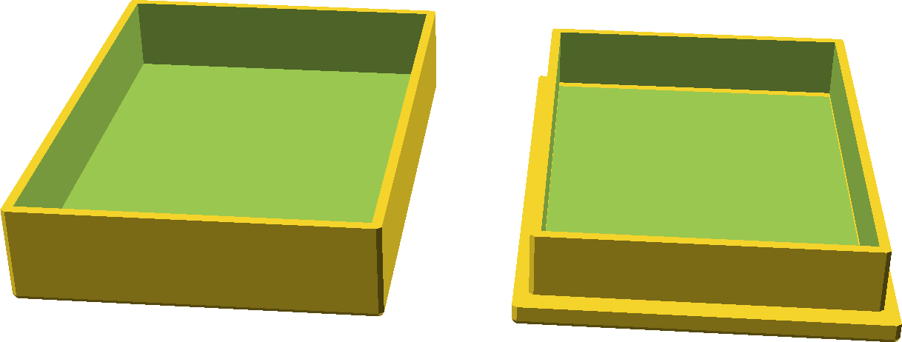

# OpenSCAD

My public OpenSCAD models and libraries

## Models

### [Precise box](preciseBox/README.md) 

Parametric full coverred box.

## License

This work is licensed under the Creative Commons Attribution-NonCommercial-ShareAlike 4.0 International License. To view a copy of this license, visit http://creativecommons.org/licenses/by-nc-sa/4.0/ or send a letter to Creative Commons, PO Box 1866, Mountain View, CA 94042, USA.
