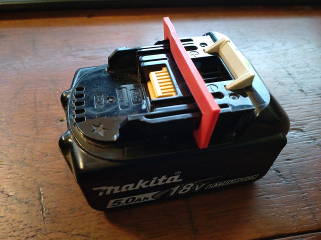

# Yet another battery holder

Yet another (under desk) battery holder created in OpenSCAD and fully customized.

Because I have multiple battery tool types from multiple manufacturers, I have created my own for parametric design.

Battery holder mesures are for:

* [x] Makita 18V (defaults)
* [x] Blacke+Decker 18V
* [ ] Parkside 18V

You can create your own size for your battery and test it. Model type "test" in customizer creates small (3 mm length) shape for probing right battery measure.

