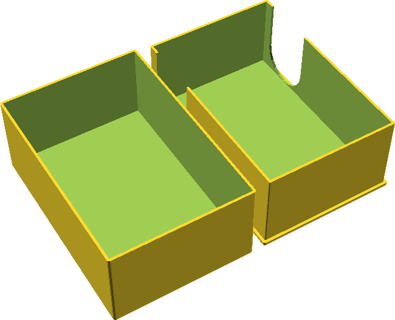
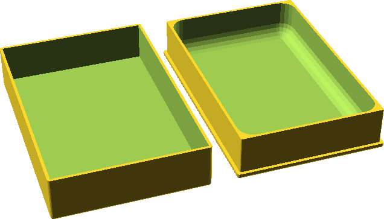

# Precise box

Parametric box with full cover.

## Simple precise box

Small box for small things. Bigger size 57x38x16 mm fits into my cigarette lighter pocket (classic zippo lighter sizes are 2.25x1.5x0.5 inches).

## Card box

Box for playing cards. Bigger version I use for printed photos (format 10x15)

## Pin box

Small box with rounded interrior corners. So small pins can be easily removed from box.

